# 
 DIO - BootCamp DataBase Experience 

## 
 15 - Construindo seu Primeiro Projeto Logico de Banco de Dados

*Desafio do projeto:*

1. Mapeamento do esquema ER para Relacional
2. Definição do script SQL para criação do esquema de banco de dados
3. Persistência de dados para testes
4. Recuperação de informações com queries SQL

*Sendo assim, crie queries SQL com as cláusulas abaixo:*

* Recuperações simples com SELECT Statement
* Filtros com WHERE Statement
* Crie expressões para gerar atributos derivados
* Defina ordenações dos dados com ORDER BY
* Condições de filtros aos grupos – HAVING Statement
* Crie junções entre tabelas para fornecer uma
* perspectiva mais complexa dos dados

---

### 1. Mapeamento do esquema ER para Relacional

#### 'ecommerce' - EER(Enhanced entity–relationship model)

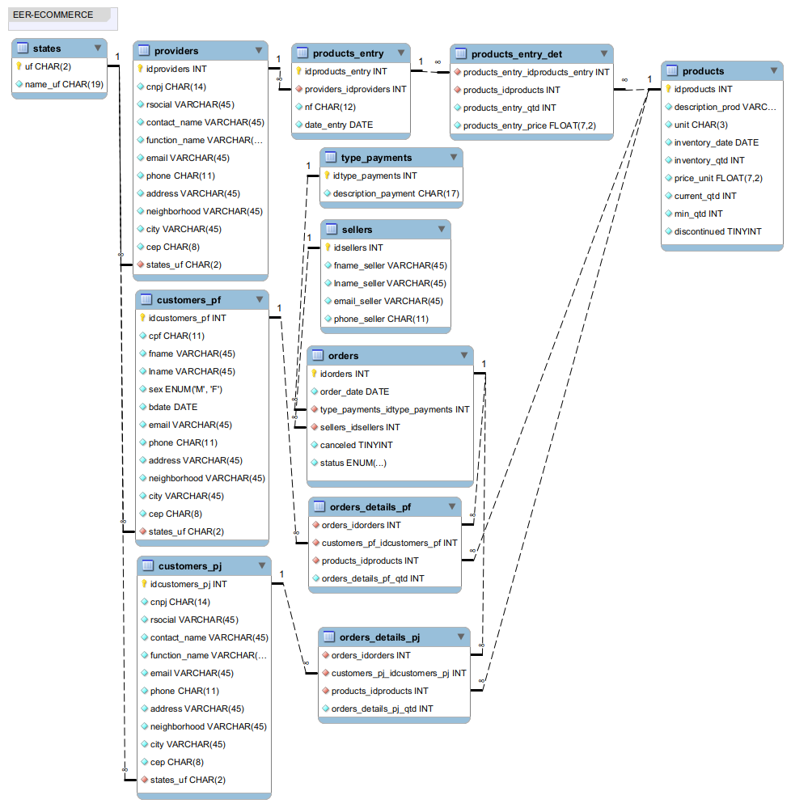

---

### 2. Definição do script SQL para criação do esquema de banco de dados

-- MySQL Workbench Forward Engineering

SET @OLD_UNIQUE_CHECKS=@@UNIQUE_CHECKS, UNIQUE_CHECKS=0;
SET @OLD_FOREIGN_KEY_CHECKS=@@FOREIGN_KEY_CHECKS, FOREIGN_KEY_CHECKS=0;
SET @OLD_SQL_MODE=@@SQL_MODE, SQL_MODE='ONLY_FULL_GROUP_BY,STRICT_TRANS_TABLES,NO_ZERO_IN_DATE,NO_ZERO_DATE,ERROR_FOR_DIVISION_BY_ZERO,NO_ENGINE_SUBSTITUTION';

-- -----------------------------------------------------
-- Schema ecommerce
-- -----------------------------------------------------
CREATE SCHEMA IF NOT EXISTS `ecommerce` ;
USE `ecommerce` ;

-- -----------------------------------------------------
-- Table `ecommerce`.`states`
-- -----------------------------------------------------
CREATE TABLE IF NOT EXISTS `ecommerce`.`states` (
  `uf` CHAR(2) NOT NULL COMMENT 'Sigla da Unidade Federativa',
  `name_uf` CHAR(19) NOT NULL COMMENT 'Nome da Unidade Federativa',
  PRIMARY KEY (`uf`))
ENGINE = InnoDB
COMMENT = 'Tabela dos estados da federação.';

-- -----------------------------------------------------
-- Table `ecommerce`.`providers`
-- -----------------------------------------------------
CREATE TABLE IF NOT EXISTS `ecommerce`.`providers` (
  `idproviders` INT NOT NULL AUTO_INCREMENT,
  `cnpj` CHAR(14) NOT NULL COMMENT 'Número do CNPJ',
  `rsocial` VARCHAR(45) NOT NULL COMMENT 'Razão Social da Empresa',
  `contact_name` VARCHAR(45) NOT NULL COMMENT 'Nome para contato',
  `function_name` VARCHAR(45) NOT NULL COMMENT 'Descrição do cargo.',
  `email` VARCHAR(45) NOT NULL COMMENT 'email do contato',
  `phone` CHAR(11) NOT NULL COMMENT 'Telefone contato/empresa',
  `address` VARCHAR(45) NOT NULL COMMENT 'Endereço empresa',
  `neighborhood` VARCHAR(45) NOT NULL COMMENT 'Bairro empresa',
  `city` VARCHAR(45) NOT NULL COMMENT 'Cidade da empresa',
  `cep` CHAR(8) NOT NULL COMMENT 'Código de endereçamento postal da empresa',
  `states_uf` CHAR(2) NOT NULL COMMENT 'FK',
  PRIMARY KEY (`idproviders`),
  INDEX `fk_providers_states_uf` (`states_uf` ASC) VISIBLE,
  CONSTRAINT `fk_providers_states_uf`
    FOREIGN KEY (`states_uf`)
    REFERENCES `ecommerce`.`states` (`uf`)
    ON DELETE NO ACTION
    ON UPDATE NO ACTION)
ENGINE = InnoDB
COMMENT = 'Tabela de Fornecedores.';

-- -----------------------------------------------------
-- Table `ecommerce`.`products`
-- -----------------------------------------------------
CREATE TABLE IF NOT EXISTS `ecommerce`.`products` (
  `idproducts` INT NOT NULL AUTO_INCREMENT,
  `description_prod` VARCHAR(70) NOT NULL COMMENT 'Descrição do produto',
  `unit` CHAR(3) NOT NULL COMMENT 'Unidade de medida do produto',
  `inventory_date` DATE NOT NULL COMMENT 'Data do inventário',
  `inventory_qtd` INT NOT NULL COMMENT 'Quantidade inventariado',
  `price_unit` FLOAT(7,2) NOT NULL COMMENT 'Preço unitário',
  `current_qtd` INT NOT NULL COMMENT 'Quantidade atual',
  `min_qtd` INT NOT NULL COMMENT 'Quantidade mínima do estoque',
  `discontinued` TINYINT NOT NULL DEFAULT 0 COMMENT '0 = Produto Continuado; 1 = Produto Descontinuado',
  PRIMARY KEY (`idproducts`))
ENGINE = InnoDB
COMMENT = 'Tabela de Produtos';

-- -----------------------------------------------------
-- Table `ecommerce`.`customers_pf`
-- -----------------------------------------------------
CREATE TABLE IF NOT EXISTS `ecommerce`.`customers_pf` (
  `idcustomers_pf` INT NOT NULL AUTO_INCREMENT COMMENT 'PK pessoa física',
  `cpf` CHAR(11) NOT NULL COMMENT 'Cadastro de Pessoa Física ',
  `fname` VARCHAR(45) NOT NULL COMMENT 'Primeiro Nome pessoa física',
  `lname` VARCHAR(45) NOT NULL COMMENT 'Último nome pessoa física',
  `sex` ENUM('M', 'F') NOT NULL COMMENT 'Gênero sexual pessoa física',
  `bdate` DATE NOT NULL COMMENT 'Data de Nascimento pessoa física',
  `email` VARCHAR(45) NOT NULL COMMENT 'Endereço email pessoa física',
  `phone` CHAR(11) NOT NULL COMMENT 'Número telefone pessoa física',
  `address` VARCHAR(45) NOT NULL COMMENT 'Endereço cliente pessoa física',
  `neighborhood` VARCHAR(45) NOT NULL COMMENT 'Bairro pessoa física',
  `city` VARCHAR(45) NOT NULL COMMENT 'Cidade pessoa física',
  `cep` CHAR(8) NOT NULL COMMENT 'Código de endereçamento postal pessoa física',
  `states_uf` CHAR(2) NOT NULL COMMENT 'FK',
  PRIMARY KEY (`idcustomers_pf`),
  INDEX `fk_customers_pf_states_uf` (`states_uf` ASC) VISIBLE,
  CONSTRAINT `fk_customers_pf_states_uf`
    FOREIGN KEY (`states_uf`)
    REFERENCES `ecommerce`.`states` (`uf`)
    ON DELETE NO ACTION
    ON UPDATE NO ACTION)
ENGINE = InnoDB
COMMENT = 'Tabela Clientes Pessoa Física';

-- -----------------------------------------------------
-- Table `ecommerce`.`customers_pj`
-- -----------------------------------------------------
CREATE TABLE IF NOT EXISTS `ecommerce`.`customers_pj` (
  `idcustomers_pj` INT NOT NULL AUTO_INCREMENT COMMENT 'PK pessoa Jurídica',
  `cnpj` CHAR(14) NOT NULL COMMENT 'Cadastro Nacional da Pessoa Jurídica',
  `rsocial` VARCHAR(45) NOT NULL COMMENT 'Razão Social',
  `contact_name` VARCHAR(45) NOT NULL COMMENT 'Nome responsável pessoa jurídica',
  `function_name` VARCHAR(45) NOT NULL COMMENT 'Cargo(função) pessoa jurídica',
  `email` VARCHAR(45) NOT NULL COMMENT 'Endereço email pessoa jurídica',
  `phone` CHAR(11) NOT NULL COMMENT 'Número telefone pessoa jurídia',
  `address` VARCHAR(45) NOT NULL COMMENT 'Endereço cliente pessoa jurídica',
  `neighborhood` VARCHAR(45) NOT NULL COMMENT 'Bairro pessoa jurídica',
  `city` VARCHAR(45) NOT NULL COMMENT 'Cidade pessoa jurídica',
  `cep` CHAR(8) NOT NULL COMMENT 'Código de endereçamento postal pessoa jurídica',
  `states_uf` CHAR(2) NOT NULL COMMENT 'FK',
  PRIMARY KEY (`idcustomers_pj`),
  INDEX `fk_customers_pj_states_uf` (`states_uf` ASC) VISIBLE,
  CONSTRAINT `fk_customers_pj_states_uf`
    FOREIGN KEY (`states_uf`)
    REFERENCES `ecommerce`.`states` (`uf`)
    ON DELETE NO ACTION
    ON UPDATE NO ACTION)
ENGINE = InnoDB
COMMENT = 'Tabela Clientes Pessoa Jurídica';

-- -----------------------------------------------------
-- Table `ecommerce`.`products_entry`
-- -----------------------------------------------------
CREATE TABLE IF NOT EXISTS `ecommerce`.`products_entry` (
  `idproducts_entry` INT NOT NULL AUTO_INCREMENT COMMENT 'PK',
  `providers_idproviders` INT NOT NULL,
  `nf` CHAR(12) NOT NULL COMMENT 'Nota Fiscal',
  `date_entry` DATE NOT NULL COMMENT 'Data emissão da Nota Fiscal',
  PRIMARY KEY (`idproducts_entry`),
  INDEX `fk_products_entry_providers_idproviders` (`providers_idproviders` ASC) VISIBLE,
  CONSTRAINT `fk_products_entry_providers_idproviders`
    FOREIGN KEY (`providers_idproviders`)
    REFERENCES `ecommerce`.`providers` (`idproviders`)
    ON DELETE NO ACTION
    ON UPDATE NO ACTION)
ENGINE = InnoDB
COMMENT = 'Tabela para entrada(compra) de produtos';

-- -----------------------------------------------------
-- Table `ecommerce`.`products_entry_det`
-- -----------------------------------------------------
CREATE TABLE IF NOT EXISTS `ecommerce`.`products_entry_det` (
  `products_entry_idproducts_entry` INT NOT NULL COMMENT 'FK - products_entry',
  `products_idproducts` INT NOT NULL COMMENT 'FK - products',
  `products_entry_qtd` INT NOT NULL COMMENT 'Quantidade da compra',
  `products_entry_price` FLOAT(7,2) NOT NULL COMMENT 'Preço unitário da compra',
  INDEX `fk_products_entry_det_products_entry_idproducts_entry` (`products_entry_idproducts_entry` ASC) VISIBLE,
  INDEX `fk_products_entry_det_products_idproducts` (`products_idproducts` ASC) VISIBLE,
  CONSTRAINT `fk_products_entry_det_products_entry_idproducts_entry`
    FOREIGN KEY (`products_entry_idproducts_entry`)
    REFERENCES `ecommerce`.`products_entry` (`idproducts_entry`)
    ON DELETE NO ACTION
    ON UPDATE NO ACTION,
  CONSTRAINT `fk_products_entry_det_products_idproducts`
    FOREIGN KEY (`products_idproducts`)
    REFERENCES `ecommerce`.`products` (`idproducts`)
    ON DELETE NO ACTION
    ON UPDATE NO ACTION)
ENGINE = InnoDB
COMMENT = 'Detalha entrada(compra) de produtos';

-- -----------------------------------------------------
-- Table `ecommerce`.`type_payments`
-- -----------------------------------------------------
CREATE TABLE IF NOT EXISTS `ecommerce`.`type_payments` (
  `idtype_payments` INT NOT NULL AUTO_INCREMENT COMMENT 'PK',
  `description_payment` CHAR(17) NOT NULL DEFAULT 'Cartão de crédito' COMMENT 'Descrição da forma de pagamento',
  PRIMARY KEY (`idtype_payments`))
ENGINE = InnoDB
COMMENT = 'Tabela tipos de pagamentos';

-- -----------------------------------------------------
-- Table `ecommerce`.`sellers`
-- -----------------------------------------------------
CREATE TABLE IF NOT EXISTS `ecommerce`.`sellers` (
  `idsellers` INT NOT NULL AUTO_INCREMENT,
  `fname_seller` VARCHAR(45) NOT NULL COMMENT 'Primeiro nome do vendedor',
  `lname_seller` VARCHAR(45) NOT NULL COMMENT 'Último nome do vendedor',
  `email_seller` VARCHAR(45) NOT NULL COMMENT 'email vendedor',
  `phone_seller` CHAR(11) NOT NULL COMMENT 'Telefone vendedor',
  PRIMARY KEY (`idsellers`))
ENGINE = InnoDB
COMMENT = 'Tabela vendedores(terceiros)';

-- -----------------------------------------------------
-- Table `ecommerce`.`orders`
-- -----------------------------------------------------
CREATE TABLE IF NOT EXISTS `ecommerce`.`orders` (
  `idorders` INT NOT NULL AUTO_INCREMENT COMMENT 'PK',
  `order_date` DATE NOT NULL COMMENT 'Data do pedido',
  `type_payments_idtype_payments` INT NOT NULL,
  `sellers_idsellers` INT NOT NULL,
  `canceled` TINYINT NOT NULL DEFAULT 0 COMMENT '0 = confirmado\n1 = cancelado',
  `status` ENUM('in progress', 'delivered') NOT NULL DEFAULT 'in progress',
  PRIMARY KEY (`idorders`),
  INDEX `fk_orders_type_payments_idtype_payments` (`type_payments_idtype_payments` ASC) VISIBLE,
  INDEX `fk_orders_sellers_idsellers` (`sellers_idsellers` ASC) VISIBLE,
  CONSTRAINT `fk_orders_type_payments_idtype_payments`
    FOREIGN KEY (`type_payments_idtype_payments`)
    REFERENCES `ecommerce`.`type_payments` (`idtype_payments`)
    ON DELETE NO ACTION
    ON UPDATE NO ACTION,
  CONSTRAINT `fk_orders_sellers_idsellers`
    FOREIGN KEY (`sellers_idsellers`)
    REFERENCES `ecommerce`.`sellers` (`idsellers`)
    ON DELETE NO ACTION
    ON UPDATE NO ACTION)
ENGINE = InnoDB
COMMENT = 'Tabela pedidos\n';

-- -----------------------------------------------------
-- Table `ecommerce`.`orders_details_pf`
-- -----------------------------------------------------
CREATE TABLE IF NOT EXISTS `ecommerce`.`orders_details_pf` (
  `orders_idorders` INT NOT NULL COMMENT 'FK - orders',
  `customers_pf_idcustomers_pf` INT NOT NULL COMMENT 'FK - customers_pf',
  `products_idproducts` INT NOT NULL COMMENT 'FK - products',
  `orders_details_pf_qtd` INT NOT NULL COMMENT 'Quantidade do pedido',
  INDEX `fk_orders_datails_pf_orders_idorders` (`orders_idorders` ASC) VISIBLE,
  INDEX `fk_orders_datails_pf_customers_pf_idcustomers_pf` (`customers_pf_idcustomers_pf` ASC) VISIBLE,
  INDEX `fk_orders_datails_pf_products_idproducts` (`products_idproducts` ASC) VISIBLE,
  CONSTRAINT `fk_orders_datails_pf_orders_idorders`
    FOREIGN KEY (`orders_idorders`)
    REFERENCES `ecommerce`.`orders` (`idorders`)
    ON DELETE NO ACTION
    ON UPDATE NO ACTION,
  CONSTRAINT `fk_orders_datails_pf_customers_pf_idcustomers_pf`
    FOREIGN KEY (`customers_pf_idcustomers_pf`)
    REFERENCES `ecommerce`.`customers_pf` (`idcustomers_pf`)
    ON DELETE NO ACTION
    ON UPDATE NO ACTION,
  CONSTRAINT `fk_orders_datails_pf_products_idproducts`
    FOREIGN KEY (`products_idproducts`)
    REFERENCES `ecommerce`.`products` (`idproducts`)
    ON DELETE NO ACTION
    ON UPDATE NO ACTION)
ENGINE = InnoDB;

-- -----------------------------------------------------
-- Table `ecommerce`.`orders_details_pj`
-- -----------------------------------------------------
CREATE TABLE IF NOT EXISTS `ecommerce`.`orders_details_pj` (
  `orders_idorders` INT NOT NULL COMMENT 'FK - orders',
  `customers_pj_idcustomers_pj` INT NOT NULL COMMENT 'FK - customers_pj',
  `products_idproducts` INT NOT NULL COMMENT 'FK - products',
  `orders_details_pj_qtd` INT NOT NULL COMMENT 'quantidade do pedido',
  INDEX `fk_orders_details_pj_orders_idorders` (`orders_idorders` ASC) VISIBLE,
  INDEX `fk_orders_details_pj_customers_pj_idcustomers_pj` (`customers_pj_idcustomers_pj` ASC) VISIBLE,
  INDEX `fk_orders_details_pj_products_idproducts` (`products_idproducts` ASC) VISIBLE,
  CONSTRAINT `fk_orders_details_pj_orders_idorders`
    FOREIGN KEY (`orders_idorders`)
    REFERENCES `ecommerce`.`orders` (`idorders`)
    ON DELETE NO ACTION
    ON UPDATE NO ACTION,
  CONSTRAINT `fk_orders_details_pj_customers_pj_idcustomers_pj`
    FOREIGN KEY (`customers_pj_idcustomers_pj`)
    REFERENCES `ecommerce`.`customers_pj` (`idcustomers_pj`)
    ON DELETE NO ACTION
    ON UPDATE NO ACTION,
  CONSTRAINT `fk_orders_details_pj_products_idproducts`
    FOREIGN KEY (`products_idproducts`)
    REFERENCES `ecommerce`.`products` (`idproducts`)
    ON DELETE NO ACTION
    ON UPDATE NO ACTION)
ENGINE = InnoDB;

SET SQL_MODE=@OLD_SQL_MODE;
SET FOREIGN_KEY_CHECKS=@OLD_FOREIGN_KEY_CHECKS;
SET UNIQUE_CHECKS=@OLD_UNIQUE_CHECKS;

---

### 3. Persistência de dados para testes

INSERT INTO states (uf, name_uf) 
VALUES
('AC','Acre'),
('AL','Alagoas'),
('AM','Amazonas'),
('AP','Amapá'),
('BA','Bahia'),
('CE','Ceará'),
('DF','Distrito Federal'),
('ES','Espírito Santo'),
('GO','Goiás'),
('MA','Maranhão'),
('MG','Minas Gerais'),
('MS','Mato Grosso do Sul'),
('MT','Mato Grosso'),
('PA','Pará'),
('PB','Paraíba'),
('PE','Pernambuco'),
('PI','Piauí'),
('PR','Paraná'),
('RJ','Rio de Janeiro'),
('RN','Rio Grande do Norte'),
('RO','Rondônia'),
('RR','Roraima'),
('RS','Rio Grande do Sul'),
('SC','Santa Catarina'),
('SE','Sergipe'),
('SP','São Paulo'),
('TO','Tocantins');

INSERT INTO type_payments (description_payment) 
VALUES
('Cartão de crédito'),
('Cartão de débito'),
('Boleto bancário'),
('PIX');

INSERT INTO sellers (fname_seller, lname_seller, email_seller, phone_seller) 
VALUES
('Luiz','Toledo','ltoledo@ig.com.br','11958642541'),
('Beatriz','Souza','biasouza@gmail.com','11952874195'),
('Ana','Silva','anasilva@hotmail.com','21988523974'),
('Carlos','Cordeiro','cordeiro@hotmail.com','51922569147'),
('Geraldo','Lima','geraldol@gmail.com','41988541299');

INSERT INTO products (description_prod,unit,inventory_date,inventory_qtd,price_unit,current_qtd,min_qtd,discontinued) 
VALUES
('Mouse Logitech','UN','2022-10-10',35,60.00,35,10,0),
('Teclado padrão com fio USB Logitech K120', 'UN', '2022-10-30', 35, 76.77, 40, 10, 0),
('Monitor Samsung LED23.5 Wid Curvo,FullHD,HDMI/VGA', 'UN', '2022-10-10', 10, 799.99, 9, 5, 0),
('Notebook Lenovo ideapad Gaming 3i i5-10300H 8GB','UN','2022-09-30',5,4654.05,4,1,0),
('Impressora multifuncinal HP DeskJet 2774 Wi-Fi','UN','2022-12-30',3,344.26,3,1,0),
('Suporte para Notebook, Preto','UN','2022-09-15',7,39.99,5,2,0);

INSERT INTO providers (cnpj, rsocial, contact_name, function_name, email, phone, address, neighborhood, city, cep, states_uf) 
VALUES
('54265845632589','3 irmãos','João Conrado','Vendedor','jconrado@hotmail.com','21998780987','Rua América, 76','Bairro das Andorinhas','São Paulo','85714269', 'SP'),
('89658456321223','Loja Maricota','Maria do Carmo','Vendedor','mcarmo@hotmail.com','31989780231','Rua dos Tupis, 322 - Loja L11/L13','Centro','Belo Horizonte','30190060', 'MG'),
('59965845632007','L4 Comercial Ltda','José Geraldo','Vendedor','zegeraldo@gmail.com','11940858100','R. Maria Joaquina, 87','Brás','São Paulo','03016010', 'SP'),
('54165845632780','Planar Eletrônica Ltda','Marcus Azevedo','Vendedor','mazevedo@gmail.com','21922638308','Av. Mal. Floriano, 139','Centro','Rio de Janeiro','20080005', 'RJ'),
('94265845632580','Casas Assis','Juliana Brandão','Vendedor','julianabrandao@gmail.com','31999780978','Rua das Canárias, 125','Santo Antônio','Belo Horizonte','90122553', 'MG');

INSERT INTO customers_pf (cpf,fname,lname,sex,bdate,email,phone,address,neighborhood,city,cep,states_uf) 
VALUES
('57489365584','Simone','Cintra','F','1978-09-08','simonecintra@hotmail.com','21985896411','Rua Marte, 166','Santo Ignácio','São Paulo','85714269','SP'),
('21568332411','Carla','Oliveira','F','1989-06-12','carlaoliv@gmail.com','31985896411','Rua Vênus, 99','Nova York','Belo Horizonte','55698447','MG'),
('88742695583','Anderson','Coelho','M','1968-09-11','andersonc@hotmail.com','31955231488','Rua Nove, 77','Santo Agostinho','Belo Horizonte','55693324','MG'),
('66577423984','Maria','Lima','F','1960-10-08','marialima@gmail.com','11955214777','Rua Lins, 600','Brás','Santo Amaro','55789635','SP'),
('11458962279','Leonardo','Santos','M','1988-01-10','lsantos@hotmail.com','21985896411','Rua Genova, 10','Asa Norte','Rio de Janeiro','55986632','RJ'),
('99523687445','Marina','Costa','F','1958-03-02','marinacosta@gmail.com','31955746922','Rua Paris, 74','Bairro Santo Antônio','Belo Horizonte','31030220','MG');

INSERT INTO customers_pj (cnpj,rsocial,contact_name,function_name,email,phone,address,neighborhood,city,cep,states_uf) 
VALUES
('12584711256358','R444 Ltda','José Geraldo','Gerente Geral','zegeraldo@hotmail.com','11988545521','Rua da Travessa, 21','Limeiroeiro','São Paulo','22145877','SP'),
('88874522145632','Tech Mais Ltda','Luiza Souza','Compradora','Luizasouza@gmail.com','21985587741','Rua 2, 44','Abre Campo','São Gonçalo','55689911','RJ'),
('66998744122587','Três marias S.A.','Marcio Sá','Comprador','marciosa@gmail.com','33955478112','Av. Andradas, 1244','Centro','Ubá','27784471','MG'),
('99874475512475','Eletro Biz','Jussara Gomes','Gerente de compras','jussarag@hotmail.com','31955478112','Av. 1 de maio, 10','Centro','Belo Horizonte','33524417','MG');

INSERT INTO products_entry (providers_idproviders,nf,date_entry) 
VALUES
(3,'001259965847','2022-09-18'),
(2,'225699884122','2021-10-01'),
(2,'000000025669','2022-01-05'),
(3,'000005255897','2018-02-03'),
(1,'0012533','2022-01-02'),
(1,'00001235','2020-03-03'),
(1,'000989','2021-05-09'),
(2,'0000055587','2019-10-11'),
(4,'122356','2019-04-05'),
(5,'0000002554','2018-05-08');

INSERT INTO products_entry_det (products_entry_idproducts_entry,products_idproducts,products_entry_qtd,products_entry_price) 
VALUES
(10,5,2,333.50),
(1,3,5,780.25),
(1,3,8,777.00),
(2,2,6,74.00),
(10,5,3,328.78),
(2,2,5,76.55);

INSERT INTO orders (order_date,type_payments_idtype_payments,sellers_idsellers,canceled,status) 
VALUES
('2022-09-01',3,1,0,'delivered'),
('2022-09-01',2,1,0,'delivered'),
('2022-09-07',1,1,0,'delivered'),
('2022-09-10',2,1,0,'in progress'),
('2022-09-18',1,1,0,'in progress');

INSERT INTO orders_details_pf (orders_idorders,customers_pf_idcustomers_pf,products_idproducts,orders_details_pf_qtd) 
VALUES
(2,3,1,1),
(2,3,4,1),
(4,1,4,1),
(1,6,6,1);

INSERT INTO orders_details_pj (orders_idorders,customers_pj_idcustomers_pj,products_idproducts,orders_details_pj_qtd) 
VALUES
(3,1,6,1),
(3,1,5,2),
(5,4,3,1),
(5,4,1,3),
(5,4,2,3);

---

### 4. Recuperação de informações com queries SQL

***Recuperações simples com SELECT Statement***

* ***states*** 
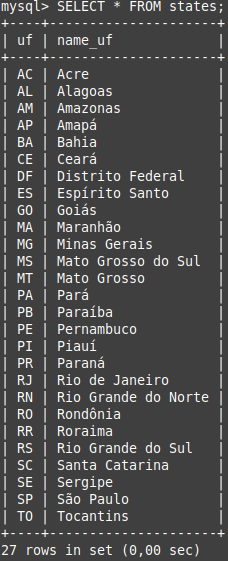
* ***type_payments***
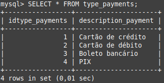
* ***sellers***
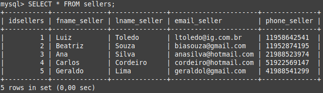
* ***products***
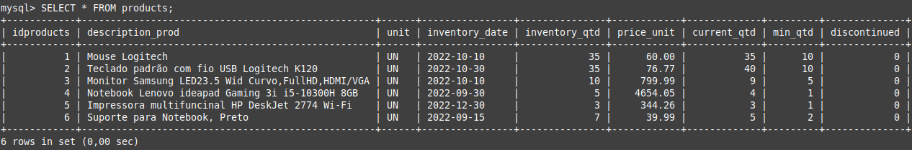
* ***providers***
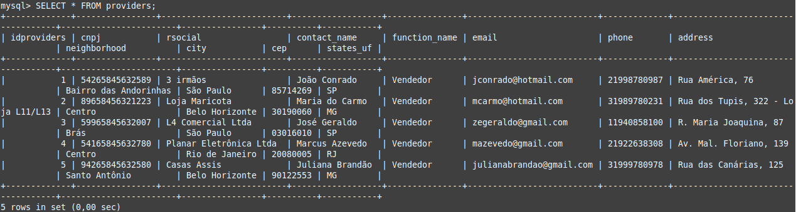
* ***customers_pf***
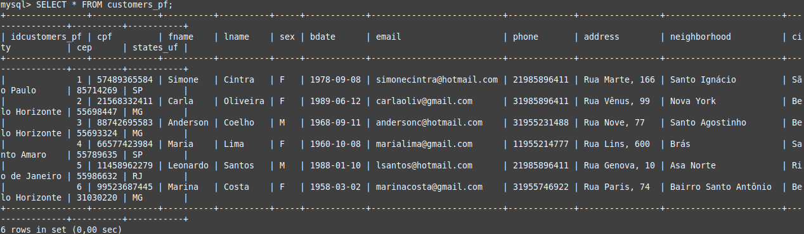
* ***customers_pj***
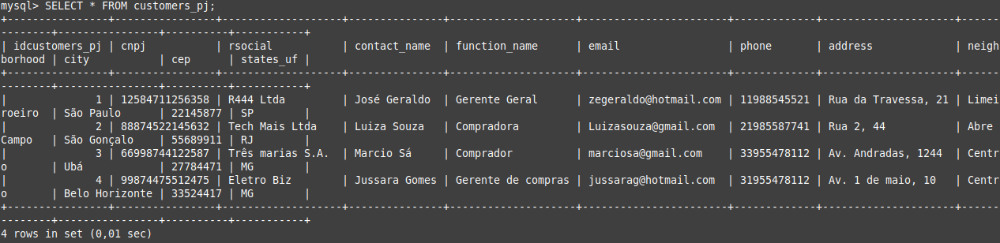
* ***products_entry***
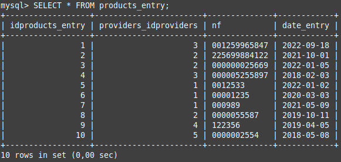
* ***products_entry_det***
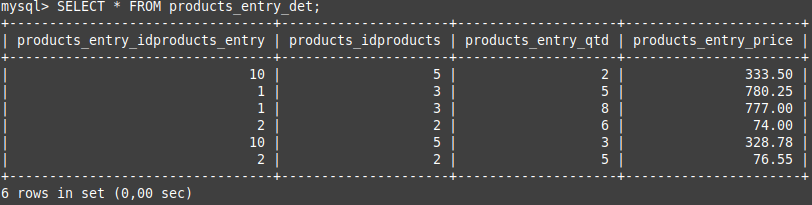
* ***orders***
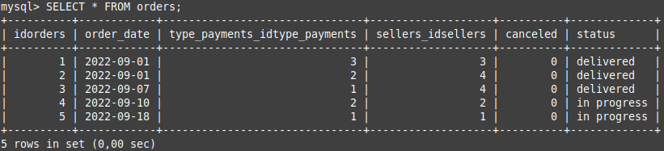
* ***orders_details_pf***
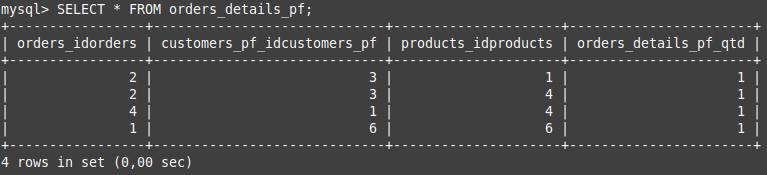
* ***orders_details_pj***
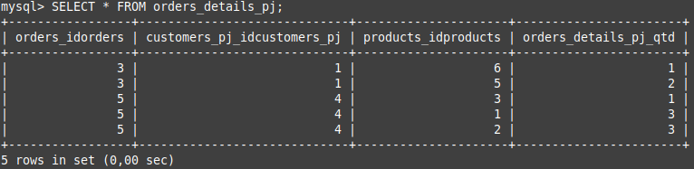

---

## 
QUERIES - Alguns exemplos ...

* *Recuperações simples com SELECT Statement*
* *Filtros com WHERE Statement*
* *Crie expressões para gerar atributos derivados*
* *Defina ordenações dos dados com ORDER BY*
* *Condições de filtros aos grupos – HAVING Statement*
* *Crie junções entre tabelas para fornecer uma*
* *perspectiva mais complexa dos dados*

#### Tabela 'orders'(pedidos): 

    
***
Como exibir a(s) forma(s) de pagamento (por extenso) da tabela orders(pedidos) ?
***

* Ex1: Exibe a 'Forma de Pagamento'(por extenso) de um determinado pedido da tabela 'orders'(pedidos): 

>SELECT * FROM orders o
>JOIN type_payments t ON o.type_payments_idtype_payments = t.idtype_payments
>WHERE o.idorders = 4;

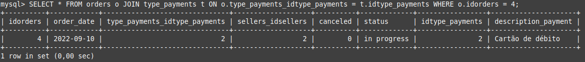

* Ex2: Exibe as 'Formas de Pagamento'(por extenso) de todos os pedidos da tabela 'orders'(pedidos): 

>SELECT * FROM orders o
>JOIN type_payments t ON o.type_payments_idtype_payments = t.idtype_payments;

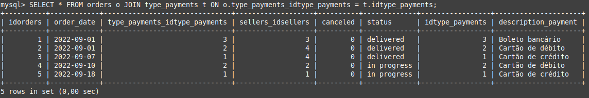

***
Ainda sobre a tabela 'orders':
***

* Quais são os vendedores(sellers) dos pedidos (nome, contato, etc) ?

>SELECT o.idorders, o.order_date, concat(s.fname_seller," ", s.lname_seller) as Vendedor, s.email_seller, s.phone_seller
>FROM orders o
>JOIN sellers s ON o.sellers_idsellers = s.idsellers;

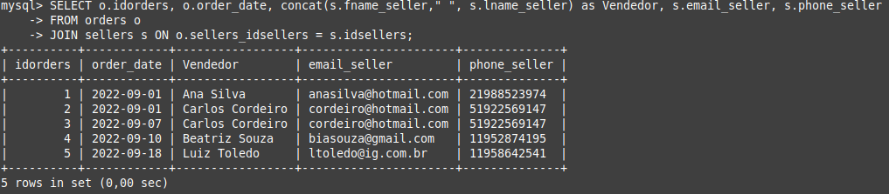

* Quais são os detalhes dos pedidos (alguns dados dos clientes e dos produtos) realizados por **pessoa física** ?

>SELECT o.idorders as PEDIDO, o.order_date as DATA, o.status, 
>concat(c.fname," ",c.lname) as CLIENTE, c.city as CIDADE, c.states_uf as UF, 
>p.description_prod as PRODUTO, d.orders_details_pf_qtd as QTDE
>FROM orders o
>JOIN orders_details_pf d ON o.idorders = d.orders_idorders
>JOIN customers_pf c ON c.idcustomers_pf = d.customers_pf_idcustomers_pf
>JOIN products p ON d.products_idproducts = p.idproducts;

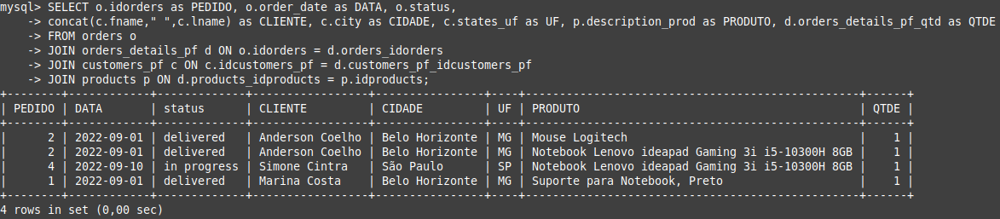

* Quais são os detalhes dos pedidos (**Quantidade x Valor unitário**) realizados por **pessoa física** ?

>SELECT o.idorders as PEDIDO, o.order_date as DATA, o.status, 
>p.description_prod as PRODUTO, d.orders_details_pf_qtd as QTDE, p.price_unit as R$_UN,
>(d.orders_details_pf_qtd * p.price_unit) as R$_TOTAL
>FROM orders o
>JOIN orders_details_pf d ON o.idorders = d.orders_idorders
>JOIN customers_pf c ON c.idcustomers_pf = d.customers_pf_idcustomers_pf
>JOIN products p ON d.products_idproducts = p.idproducts;

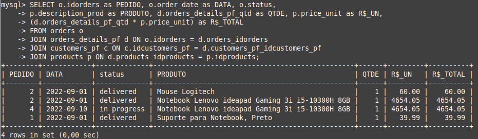

* Quais são os detalhes dos pedidos (alguns dados dos clientes e dos produtos) realizados por **pessoa jurídica** ?

>SELECT o.idorders as PEDIDO, o.order_date as DATA, o.status, 
>c.rsocial as CLIENTE, c.city as CIDADE, c.states_uf as UF, 
>p.description_prod as PRODUTO, d.orders_details_pj_qtd as QTDE
>FROM orders o
>JOIN orders_details_pj d ON o.idorders = d.orders_idorders
>JOIN customers_pj c ON c.idcustomers_pj = d.customers_pj_idcustomers_pj
>JOIN products p ON d.products_idproducts = p.idproducts;

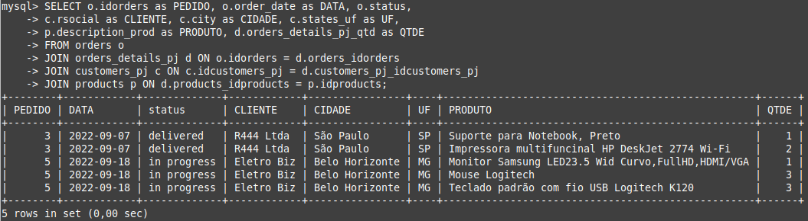

* Quais são os detalhes dos pedidos (**Quantidade x Valor unitário**) realizados por **pessoa jurídica** ?

>SELECT o.idorders as PEDIDO, o.order_date as DATA, o.status, 
>p.description_prod as PRODUTO, d.orders_details_pj_qtd as QTDE, p.price_unit as R$_UN,
>(d.orders_details_pj_qtd * p.price_unit) as R$_TOTAL
>FROM orders o
>JOIN orders_details_pj d ON o.idorders = d.orders_idorders
>JOIN customers_pj c ON c.idcustomers_pj = d.customers_pj_idcustomers_pj
>JOIN products p ON d.products_idproducts = p.idproducts;

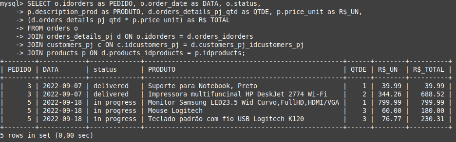

* Exemplo de **ordenação(ORDER BY)**

>SELECT cpf, concat(fname," ",lname) as CLIENTE_PF, sex, city, states_uf
>FROM customers_pf
>ORDER BY city;

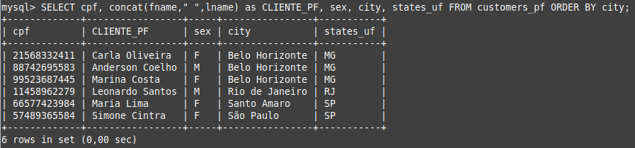

* Exemplo de **filtragem(HAVING)**

>SELECT o.idorders as PEDIDO, o.order_date as DATA, o.status, 
>p.description_prod as PRODUTO, d.orders_details_pj_qtd as QTDE, p.price_unit as R$_UN,
>(d.orders_details_pj_qtd * p.price_unit) as R$_TOTAL
>FROM orders o
>JOIN orders_details_pj d ON o.idorders = d.orders_idorders
>JOIN customers_pj c ON c.idcustomers_pj = d.customers_pj_idcustomers_pj
>JOIN products p ON d.products_idproducts = p.idproducts
>HAVING o.status = 'in progress';

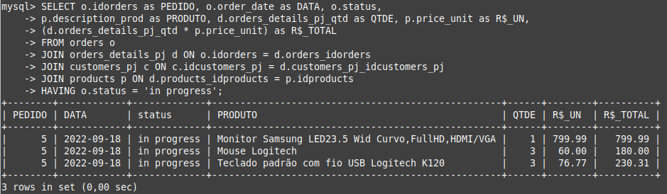

* Exemplo de **agrupamento(GROUP BY) com soma(SUM)**

>SELECT pj.orders_idorders as AGRUPAMENTO_PEDIDOS_PESSOA_JURIDICA, sum(orders_details_pj_qtd) as TOTAL_QUANTIDADE_PRODUTOS_POR_AGRUPAMENTO
>FROM orders_details_pj as pj
>GROUP BY pj.orders_idorders;

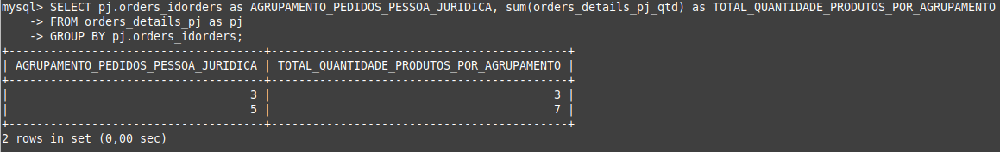

---